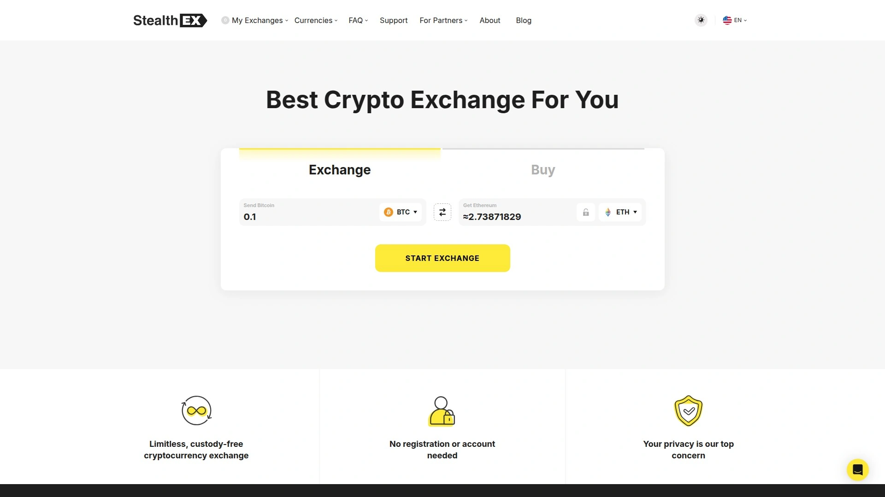
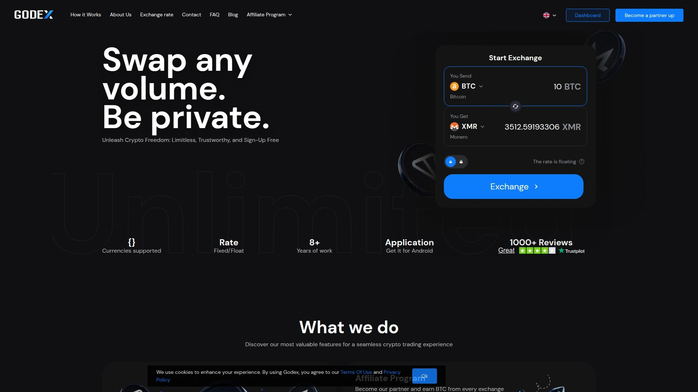

# 2025年排名前20的加密货币兑换平台汇总(最新整理)

想快速把手里的比特币换成以太坊,或者把USDT换成其他币种,但又不想在中心化交易所注册、等审核、交KYC材料?现在有一大批即时兑换平台能帮你省掉这些麻烦。这些平台有的支持固定汇率锁定价格,有的主打隐私保护不要求注册,还有的能跨链兑换几千种币。这篇文章整理了20个值得关注的加密货币兑换平台,从功能特点到适用场景都给你讲清楚。

***

## **[FixedFloat](https://ff.io)**

闪电般快速的即时兑换平台,提供固定汇率和浮动汇率两种模式供你选择。

这个平台从2018年运营至今,最大的特色就是让你自己决定用哪种兑换策略。选固定汇率的话,你看到的价格就是最终成交价,汇率锁定10分钟,只收1%手续费加网络费。选浮动汇率则只收0.5%手续费,最终价格取决于你的交易在区块链上获得确认时的市场行情。

**适用场景:** 特别适合那些需要精确控制兑换成本的用户。如果你在做大额交易或者对价格波动比较敏感,固定汇率能帮你规避市场波动风险。平台全自动化运行,兑换速度很快。

所有手续费都是透明显示的,不会有隐藏费用,这点在行业里算是很良心的做法。页面简洁直观,即使是新手也能快速上手完成兑换。

---

## **[ChangeNOW](https://changenow.io)**

支持900多种加密货币的非托管兑换平台,无需注册即可使用。

这个平台的理念就是"拿来就用",不需要创建账户,不需要存币在平台上,直接输入钱包地址就能完成兑换。支持Visa和Mastercard购买加密货币,这在非托管平台里比较少见。

提供24小时免费客户支持,遇到问题能随时找到人帮忙。汇率在市场中比较有竞争力,平台会自动帮你匹配最优价格。缺点是有些兑换不是即时完成,可能需要等10-15分钟。

支持的币种数量多,涵盖主流币和大量小币种,基本能满足各种兑换需求。

***

## **[Changelly](https://changelly.com)**

老牌即时兑换服务商,支持200多种加密货币的快速兑换。

运营时间比较长,在行业里积累了不少用户口碑。非托管模式运行,你的币不会存在平台上,兑换完直接发到你指定的钱包地址。

界面设计友好,整个兑换流程很流畅。支持用信用卡购买加密货币,方便新手入场。美国用户无法使用这个平台。

手续费相对透明,会在兑换前明确告知你所有费用。对于想要快速完成小额兑换的用户来说是个不错的选择。

***

## **[SimpleSwap](https://simpleswap.io)**

注册免费、没有额度限制的加密货币兑换平台,支持1500多种币。

这个名字起得很贴切,确实够Simple。不需要注册就能用,没有复杂的验证流程,也不要求KYC。支持的币种数量达到1500个,这个覆盖范围在行业里算是顶尖水平。

**核心优势:**
- 非托管平台,币直接发到你的钱包,不会在平台停留
- 24小时客服随时响应
- 可以用借记卡或信用卡购买30多种加密货币
- 汇率有市场竞争力

从2018年创立以来一直保持良好的安全记录。整个兑换过程直观易懂,选币种、输地址、发币、收币,四步搞定。美国居民无法访问。

***

## **[StealthEX](https://stealthex.io)**

主打隐私保护的即时兑换平台,支持400多种加密货币的跨链兑换。

从名字就能看出来,这个平台对隐私保护特别重视。不要求注册信息,也不执行KYC合规检查,让你保持匿名状态进行兑换。

平台整合了多家主流交易所的流动性,包括Binance、Huobi、KuCoin、Uniswap、PancakeSwap等。这意味着它能帮你在这些交易所里找到最优价格,自动选择最划算的兑换路径。

**技术特点:** 支持跨链兑换,几分钟内就能在不同区块链之间转移资产。手续费包含网络交易费和合作伙伴收取的费用,会在交易前透明展示。想用信用卡、Apple Pay或Samsung Pay购买加密货币的话需要注册账户。

***

## **[ChangeHero](https://changehero.io)**

提供300多种数字资产兑换的平台,主打闪电般的交易速度和安全保障。

这个平台每天处理大量交易,平均等待时间只有5分钟,这个速度在行业里算快的。支持100,000多个交易对,基本涵盖了市场上所有主流和小众币种之间的兑换需求。

提供最优市场汇率,没有账户要求,打开网站就能开始兑换。还支持用多种本地货币和支付方式购买热门加密货币,方便全球用户入场。

对企业用户提供API解决方案,可以轻松集成到自己的业务系统中。全球可用,界面支持多语言,使用门槛低。

***

## **[Exolix](https://exolix.com)**

专注于即时兑换的在线加密货币交易平台,操作简便快捷。

这是一个相对年轻但发展迅速的平台。提供固定汇率和浮动汇率两种模式,用户可以根据自己的需求选择。

界面设计简洁明了,新手也能快速理解如何操作。支持的币种覆盖主流和部分小币种,满足日常兑换需求。

交易处理速度较快,通常在区块链确认后就能完成兑换。客户反馈整体正面,服务质量稳定。

***

## **[LetsExchange](https://letsexchange.io)**

支持5000多种币和代币的超大型兑换中心,覆盖300多条区块链。

这个平台的币种支持数量是市场上最多的,5000多种币基本覆盖了你能想到的所有数字资产。由拥有10年以上加密货币和金融科技经验的团队在2020年创立。

**功能全面包括:** 跨链兑换、桥接、法币买卖加密货币、集成去中心化交易所功能。平台不在网络费和处理费之外额外收费,收费结构透明。

非托管模式,用户不需要在平台上存储资金。提供24小时客户支持,界面支持14种语言,全球用户都能方便使用。交易处理速度取决于区块链本身的速度,但平台端是全自动化即时处理的。

---

## **[Swapzone](https://swapzone.io)**

加密货币兑换聚合器,帮你比较多个平台并选择最优汇率。

这个工具的定位很聪明,它不是直接提供兑换服务,而是聚合了多个兑换平台的报价,让你一眼看到哪家最划算。

使用很简单,选择你想兑换的币种对,Swapzone会显示所有支持这个交易对的平台及其汇率,你直接选价格最好的那个就行。不需要在Swapzone上注册账户,整个过程5分钟就能完成。

这种聚合模式特别适合追求最优价格的用户,省去了自己逐个平台比价的麻烦。还提供各个兑换平台的评价和反馈,帮你判断哪个更靠谱。

***

## **[Coinbase](https://www.coinbase.com)**

美国最大的加密货币交易平台之一,特别适合新手用户。

这是一家上市公司,监管合规性很强,美国、英国、澳大利亚等100多个国家都能用。界面设计对新手极其友好,教育资源丰富,甚至还有学习奖励计划。

支持235种加密货币,除了买卖交易,还提供质押、NFT市场等功能。对于想要更高级功能的用户,Coinbase Advanced提供了专业交易工具。

**缺点是手续费相对较高**,根据交易方式不同,费率在0%-3.99%之间。但考虑到它的安全性和易用性,对新手来说仍然是个很好的起点。需要KYC认证。

***

## **[Kraken](https://www.kraken.com)**

以安全性和高级交易功能著称的专业级加密货币交易所。

成立于2011年,是行业里的老牌交易所,在190多个国家运营。支持410多种加密货币和众多交易对。

Kraken Pro提供高速交易、API集成、可定制的仪表盘,很受高级交易者和机构喜欢。支持高收益质押、保证金交易、期货等多种玩法。

手续费低,通常挂单0.16%,吃单0.26%,大户还有折扣。提供24小时客服和丰富的教育资源。完全合规,符合美国法律要求。

虽然功能强大,但新手可能需要一点时间适应,Pro平台对初学者来说可能有点复杂。

***

## **[Binance](https://www.binance.com)**

全球交易量最大的加密货币交易所,支持币种多且手续费低。

Binance的交易量是行业第一,大约是第二名的四倍。全球版本支持400多种加密货币,美国版Binance US支持158种。

手续费低到离谱,0%-0.6%之间,用BNB支付手续费还能再打折。功能非常全面,从现货交易到流动性挖矿、新币发射台、NFT市场应有尽有。

**适合全球用户和活跃交易者**,特别是在美国以外地区使用体验更好。美国用户只能用Binance US,功能相对受限。在美国面临一些监管问题需要注意。

***

## **[Gemini](https://www.gemini.com)**

以监管合规和安全性为核心的美国加密货币交易所。

受纽约金融服务部监管,合规标准很高,特别受机构投资者青睐。提供现货交易、质押、加密货币信用卡、高收益账户等全套服务。

安全措施是行业顶级,冷存储加保险支持的托管服务让资产更有保障。提供全方位的加密货币服务,包括质押和托管。

Gemini信用卡可以用消费获得加密货币奖励。安全协议包括双因素认证等多重保护。手续费结构有竞争力,高频交易者有折扣。

支持73种加密货币,虽然不如Binance和Kraken多,但都是精选的主流币种。

***

## **[Crypto.com](https://crypto.com)**

移动端体验出色的加密货币平台,配套借记卡计划很受欢迎。

在90多个国家拥有超过1亿用户,2016年成立以来发展迅速。特别适合移动优先的交易者和比特币持有者。

移动应用设计精美且功能完善,支持400多种加密货币。通过Earn计划和质押计划,用户可以获得奖励。提供比特币期权和期货交易。

**Visa借记卡是一大亮点**,可以直接用加密货币在市场上购买商品和服务。手续费结构合理,安全基础设施出色。

缺点是只在不到100个国家提供服务,客服只有聊天支持,而且只提供热钱包访问。

***

## **[Uniswap](https://uniswap.org)**

以太坊上最大的去中心化交易所,自动做市商模式的先驱。

Uniswap V3引入了集中流动性概念,让流动性提供者可以在自定义价格区间提供流动性,大大提高了资本效率。

支持900多种代币,不需要KYC,没有地域限制。作为DEX,用户完全掌控自己的资产,不需要把币存到平台上。

高级交易者喜欢Uniswap是因为它提供了灵活的流动性管理、精确的价格执行、深厚的流动性池。常与跨链聚合器配合使用,从其他区块链访问它的流动性池。

手续费根据交易对和流动性池设置不同而变化。

***

## **[PancakeSwap](https://pancakeswap.finance)**

币安智能链上最受欢迎的去中心化交易所,手续费比以太坊低很多。

运行在BNB Chain上,交易速度快且成本低,这是它相比Uniswap的主要优势。支持50多种加密货币,不需要KYC。

除了基本的代币兑换,还提供流动性挖矿、质押、NFT市场、彩票等多种玩法。用户界面设计有趣,降低了DeFi的使用门槛。

适合想要低成本交易的DeFi用户,特别是那些觉得以太坊Gas费太贵的人。完全非托管,你的私钥你自己掌握。

***

## **[Curve Finance](https://curve.fi)**

专注于稳定币交易的去中心化交易所,滑点超低。

Curve的独特之处在于它专门针对价值相近的资产优化,比如不同的稳定币(USDT、USDC、DAI)之间兑换,或者wrapped资产。它的算法能实现极低的滑点。

**专业优势:**
- 大额稳定币交易几乎没有价格影响
- 流动性提供者能获得有竞争力的收益
- 智能合约经过长期实战检验,安全性高
- 与主流DeFi协议深度集成

缺点是只支持相似价值的资产对,代币经济模型比较复杂,界面对新手不太友好。适合机构和大户进行稳定币之间的大额兑换。

***

## **[1inch](https://1inch.io)**

DEX聚合器,自动在多个去中心化交易所之间寻找最优价格。

1inch的智能路由算法会分析几十个DEX的价格,自动把你的订单拆分到最高效的路径上,通常能获得比单独使用任何一个DEX更好的价格。

可以同时跨多个DEX执行订单,确保你拿到最优汇率。提供Gas优化功能,帮你节省交易成本。支持大量DEX和代币。

为有经验的用户提供高级交易功能。缺点是界面比简单的DEX复杂一些,额外的智能合约交互会增加Gas费用,而且依赖底层DEX的流动性。

***

## **[Balancer](https://balancer.fi)**

支持多代币流动性池的去中心化交易所,最多可以在一个池子里放8种代币。

不同于大多数只支持50/50资产对的AMM,Balancer允许自定义权重配置,创建自平衡的被动投资组合。这让它不仅是个DEX,更是个投资组合设计工具。

对基金管理者和复杂交易策略的实践者来说,Balancer提供了更多灵活性。可以创建多样化的资产组合,在交易过程中自动重新平衡。

运行在多个区块链上包括以太坊和Optimism。适合需要复杂流动性管理的高级用户。

***

## **[SideShift.ai](https://sideshift.ai)**

支持30多种加密货币的快速兑换平台,无需注册即可使用。

操作完全自动化,一旦你的存款在区块链上获得一次确认,平台就会启动兑换并把资金发送到指定地址。处理时间取决于区块链确认速度,但平台端不会拖延。

平台不会在交易过程中持有用户资金,全程非托管。可以通过Trezor Suite硬件钱包直接使用SideShift.ai,不需要离开钱包应用就能完成兑换。

有自己的原生代币XAI,总供应量2.1亿枚,基于以太坊ERC-20标准。界面友好,兑换体验流畅快捷。

---

## **[Godex](https://godex.io)**

匿名交易、固定汇率、无交易额度限制的加密货币兑换平台。

秉承加密货币的创始原则,Godex坚信匿名是用户的基本权利。不需要注册,不需要个人信息,就能完成兑换。

提供固定汇率保护,让你不受市场价格波动的影响。支持200多种币,而且还在不断增加。没有交易额度上限,只有最低支付金额要求。

**运营特点:** 全自动兑换系统消除了人为错误,24小时客服随时待命。但需要注意的是,对于被标记为高风险的交易会执行严格的AML/KYC检查,受限地区的用户可能被阻止。

定位是隐私优先的加密货币兑换平台,强调固定汇率和安全性。

***

## **[Bisq](https://bisq.network)**

点对点的去中心化交易所,真正的无需信任交易。

Bisq是一个开源的P2P网络,完全去中心化,没有中央服务器。支持约30种加密货币,不需要KYC,没有地域限制。

因为是P2P模式,你直接和其他用户交易,平台只提供撮合功能。这种模式最大程度保护了隐私和资金安全。

非托管,你的资金始终在自己掌控之中。适合极度重视隐私和去中心化的用户。缺点是流动性相对中心化平台要弱一些,交易可能需要等待合适的对手方。

---

## 常见问题

**即时兑换平台和传统交易所有什么区别?**

即时兑换平台通常不需要注册账户和KYC认证,你提供钱包地址就能完成兑换,整个过程几分钟搞定。而传统交易所像Coinbase、Kraken需要注册、身份验证,但提供更多高级功能比如杠杆交易、期货、质押等。即时兑换平台更适合快速换币需求,传统交易所适合长期交易和投资。

**去中心化交易所(DEX)真的更安全吗?**

DEX的核心优势是非托管,你的资产始终在自己的钱包里,不需要信任第三方平台。但这也意味着你要完全负责自己私钥的安全,丢了就找不回来。中心化交易所虽然存在被黑客攻击的风险,但通常有保险和客户支持来应对问题。两种模式各有利弊,最安全的做法是大额长期持有用冷钱包,日常交易根据需求选择合适的平台。

**如何选择固定汇率还是浮动汇率?**

固定汇率适合对价格敏感的场景,你看到的价格就是最终价格,不会因为市场波动而改变,但手续费通常略高。浮动汇率手续费更低,但最终兑换价格取决于交易确认时的市场行情,市场涨你多得,跌你少得。如果你做大额交易或者必须精确控制成本,选固定汇率更稳妥。小额兑换且不在意轻微价格波动的话,浮动汇率更省手续费。

***

## 总结

选对加密货币兑换平台能让你的交易体验轻松很多,不同平台各有特色适合不同场景。如果你追求快速、灵活、能自主选择兑换策略,[FixedFloat](https://ff.io)提供的固定汇率和浮动汇率双模式特别适合需要精确控制成本的用户,从2018年运营至今积累了可靠的服务记录。它的透明收费和全自动化流程让兑换过程简单高效,不管你是新手还是老手都能快速上手。
